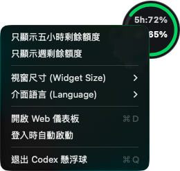

# Codex Token & Quota Monitor

[](LICENSE)

在本機查看 Codex 配額、Token 歷史與估算成本。支援 Web Dashboard、CLI、macOS 懸浮球／選單列與 MCP。

正體中文 · [English](docs/README.en.md) · [日本語](docs/README.ja.md) · [简体中文](docs/README.zh-CN.md)

## 操作截圖

以下使用 Demo 資料。介面支援英文與正體中文。

### macOS 懸浮球（HUD）

左鍵切換配額與今日估算成本；右鍵選擇顯示額度、尺寸與語言。




### Web Dashboard


<details>
<summary>週報、歷史明細與窄螢幕</summary>


</details>

## 快速開始

需要 Bun。先啟動示範：

```bash
git clone https://github.com/a861252012/codex-token-usage-history.git
cd codex-token-usage-history
bun install --frozen-lockfile
bun run demo
```

開啟 [http://127.0.0.1:10201](http://127.0.0.1:10201) · Ctrl+C

### 讀取自己的 Codex 紀錄

```bash
./bin/codex-usage dashboard
```
服務啟動時會自動匯入完整歷史，之後增量更新，不必先執行索引指令。

開啟 [http://127.0.0.1:10200](http://127.0.0.1:10200)

預設讀取 `~/.codex`；CLI、Dashboard 與原生介面可用 `CODEX_HOME` 指定目錄。配額查詢需要本機 `auth.json`，歷史查詢不需即時配額。

## 常用指令

| 目的 | 指令 |
| --- | --- |
| 唯讀環境診斷 | `./bin/codex-usage doctor`（或 `doctor --json`） |
| 配額與今日用量 | `./bin/codex-usage status` |
| 機器可讀狀態 | `./bin/codex-usage status --json` |
| 即時終端監控 | `./bin/codex-usage live` |
| 最近 50 筆紀錄 | `./bin/codex-usage history --limit 50` |
| 子代理人歷史 | `./bin/codex-usage history --role subagent --json` |
| 未知角色歷史 | `./bin/codex-usage history --role unknown --json` |
| 匯出 CSV | `./bin/codex-usage history --csv --limit 5000` |
| 最近 14 日結算 | `./bin/codex-usage report --period daily --limit 14` |
| 每週／每月／每年結算 | `./bin/codex-usage report --period weekly`（或 `monthly`、`yearly`） |
| 配額重置／方案異動 | `./bin/codex-usage resets` / `./bin/codex-usage plans` |
| 完整掃描與診斷 | `./bin/codex-usage index --all --json` |
| 強制重讀舊檔 | `./bin/codex-usage index --all --force --json` |
| 查看／更新定價 | `./bin/codex-usage pricing` / `./bin/codex-usage pricing update` |
| 重算已存歷史的估算成本 | `./bin/codex-usage reprice` |
| Shell 狀態字串 | `./bin/codex-usage prompt` |
| 指令總覽 | `./bin/codex-usage --help` |

## macOS

需 Xcode Command Line Tools。懸浮球可拖曳，左鍵切換指標，右鍵調整設定。
右鍵勾選「登入時自動啟動」，下次登入 Mac 就會開啟；再次點選可取消。搬移專案後請重新勾選。此設定只啟動 HUD，不會啟動資料更新服務。
Dashboard 的「懸浮球設定」可調整更新間隔：預設 5 秒，限 1～300 的整數，最晚於下一輪更新套用。

HUD 讀取本機快取；要持續更新配額與今日用量，先在一個終端執行並保持服務運作：

```bash
./bin/codex-usage dashboard --no-open
```

再於另一個終端編譯並啟動原生介面：

```bash
bash scripts/build-hud.sh
bash scripts/build-menubar.sh
./bin/codex-usage hud
./bin/codex-menubar &
```

選用安裝：`bash scripts/install.sh`。會建立全域捷徑、嘗試加入 MCP 設定並產生 LaunchAgent plist；不會自動載入 LaunchAgent。

<details>
<summary>Node.js</summary>

需 Node.js 22.13 以上的 22.x，或 23.4 以上版本，才能直接使用 `node:sqlite`。完整測試與 Bun 打包仍需 Bun；以下 Node 驗證不需 Bun。

```bash
node -e 'require("node:sqlite")'
npm install
npx tsc
npm run test:node
node --no-warnings dist/cli/index.js dashboard
```

</details>

## MCP

將路徑換成專案的絕對路徑：

```toml
[mcp_servers.codex_token_usage]
command = "/absolute/path/codex-token-usage-history/bin/codex-usage"
args = ["mcp"]
enabled = true
```

`get_codex_quota` · `get_codex_usage_history` · `get_codex_settlement_report` · `get_codex_reset_events` · `get_codex_plan_changes` · `get_codex_pricing_info`

## 使用注意

- 金額為標準 API 等值估算，不是訂閱帳單；每筆紀錄保留定價來源與版本。Fast、Batch、Flex、cache-write 等不同服務費率未計入。無可查證費率的模型會標示 `fallback`，不代表該模型的官方價格。
- 內建 Astra、Sol、Terra、Luna 費率在輸入（含快取）超過 272,000 Tokens 時，整筆輸入／快取採 2 倍、輸出採 1.5 倍費率；其他內建模型不預設套用此門檻。自訂或社群費率依其提供的長上下文設定計算。
- 支援新版 `token_usage_record` 與舊版累計 `token_count`；重複累計快照不重算。已被舊版本掃描過的檔案，請執行 `index --all --force --json` 補匯入。角色證據不足時保留 `unknown`。
- 更新程式或定價不會自動重算既有資料；需要套用新費率時，請自行執行 `reprice`。
- Dashboard 歷史篩選只影響表格與 CSV，單次匯出最多 5000 筆；CLI `history`／`report` 的 `--limit` 上限為 10000 筆。
- 配額會標示來源、更新時間與錯誤；掃描診斷僅代表該程序最近一輪結果。
- Dashboard 僅供本機存取。原生 UI 與 Dashboard 必須使用同一個 `CODEX_HOME`；原生介面目前固定連接 10200 埠。

內建費率與長上下文規則依 2026-09-12 查證的官方模型文件設定：[Astra](https://developers.openai.com/api/docs/models/gpt-6-astra) · [Sol](https://developers.openai.com/api/docs/models/gpt-5.6-sol) · [Terra](https://developers.openai.com/api/docs/models/gpt-5.6-terra) · [Luna](https://developers.openai.com/api/docs/models/gpt-5.6-luna) · [GPT-5](https://developers.openai.com/api/docs/models/gpt-5)。

## 開發

```bash
bun test
bun run typecheck
bun run build
```
