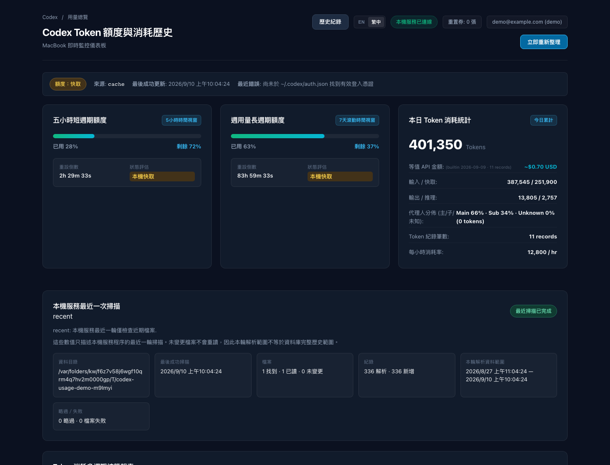

# Codex Token & Quota Monitor

把 Codex 配額、Token 歷史與估算成本集中在本機：Web Dashboard、終端機、macOS 懸浮球與 MCP 共用 SQLite 資料。

[](LICENSE)
[](https://github.com/a861252012/codex-token-usage-history/actions/workflows/ci.yml)

**文件語系：** 正體中文 · [English](docs/README.en.md) · [日本語](docs/README.ja.md) · [简体中文](docs/README.zh-CN.md)

[快速開始](#快速開始) · [操作截圖](#操作截圖) · [常用指令](#常用指令) · [疑難排解](#疑難排解) · [資料與限制](#資料與限制)

文件提供四種語系；Dashboard 介面目前支援 English／正體中文，不包含日文或簡體中文介面。

這是社群專案，並非 OpenAI 官方產品。金額是依專案定價表換算的 **API 等值估算**，不是 ChatGPT 訂閱帳單，也不代表實際扣款。

| 想做什麼 | 從這裡開始 |
| --- | --- |
| 不登入先試用 | `bun run demo` → port 10201，僅使用示範資料 |
| 看自己的使用紀錄 | `doctor` → `index --all --json` → `dashboard` |
| 在終端機查詢 | `./bin/codex-usage status` 或 `history --limit 50` |
| 接入其他工具 | 下方的 [MCP 設定](#mcp) |

## 操作截圖

以下是實際啟動此專案、以瀏覽器操作後擷取的 PNG，並非設計稿。畫面使用 `bun run demo` 產生的示範紀錄與配額，帳號為 `demo@example.com`；不含真實使用者的帳號或 Session 資料。

### 配額與每日用量

查看五小時／每週視窗、今日 Token、估算成本與主／子代理人用量。右上角可切換英文與正體中文。



<details>
<summary>English dashboard</summary>


</details>

### 切換每週報表

點選「每週結算」，比較各週的 Token、估算成本與代理人用量。


### 篩選 subagent 與匯出 CSV

在歷史紀錄區、表格正上方選擇「僅 subAgent」，也可搭配即時模型搜尋。篩選只影響歷史與 CSV，不影響總覽和結算；「重設條件」可還原全部紀錄。頁首的「歷史紀錄」可直接跳到此區。歷史表格的「查看」會開啟完整 Session／Thread／Turn 及已儲存定價來源／版本，按 Escape 可關閉。

「匯出 CSV」採用目前篩選條件，最多 5,000 筆，並包含逐筆定價來源與版本。載入時表格顯示骨架列；空結果提供重設操作，失敗則可重試。重新整理與匯出期間會停用按鈕，避免重複送出。本介面沒有刪除或批次異動功能。低頻使用的配額重置與方案異動預設收合，需要時再展開。


<details>
<summary>查看紀錄明細（Firefox 實測）</summary>


</details>

<details>
<summary>窄視窗顯示（390px）</summary>


這是本機瀏覽器的窄視窗測試；Dashboard 仍僅允許 loopback 連線，並非開放給手機透過區網存取。

</details>

## 快速開始

### 先看示範，不需登入

準備 Bun。原生 HUD／選單列另需 macOS 與 Xcode Command Line Tools（`swiftc`）。

```bash
git clone https://github.com/a861252012/codex-token-usage-history.git
cd codex-token-usage-history
bun install --frozen-lockfile
bun run demo
```

開啟 [http://127.0.0.1:10201](http://127.0.0.1:10201)。示範在臨時目錄產生 14 天資料，正常結束時清除；使用 `Ctrl+C` 停止。原生 HUD 不會隨示範啟動。

### 使用自己的 Codex 紀錄

```bash
# 唯讀檢查環境，不登入、不連網，也不建立資料庫
./bin/codex-usage doctor

# 索引 sessions 與 archived_sessions
./bin/codex-usage index --all --json

# 啟動 Web Dashboard
./bin/codex-usage dashboard
```

`doctor --json` 也可輸出機器可讀結果。它只檢查 runtime、SQLite 能力、資料路徑與讀取權限；不讀取 `auth.json` 內容、不驗證登入、不連網，也不建立 `token_usage_history.sqlite`。`index --all --json` 會建立／更新本機索引，並回傳本輪掃描、略過、失敗、無效行、無效紀錄與不支援事件等診斷；其中資料起訖只涵蓋本輪實際成功讀取的有效紀錄，不代表整個資料庫的涵蓋範圍。

Dashboard 預設網址為 [http://127.0.0.1:10200](http://127.0.0.1:10200)。配額讀取需要可用的本機 `auth.json`；沒有登入資料時，歷史查詢仍可使用。介面會標示配額來源、最後成功取得時間與失敗原因；只有兩分鐘內、沒有錯誤的 `wham` 快照會標為即時。快取或 fallback 不是即時配額，缺值也不代表 100% 可用或無限額度。程式不會替你登入。

Dashboard 的「本機服務最近一次掃描」只顯示目前本機服務最近一輪索引的 scope、資料目錄、最後成功掃描、檔案／紀錄／略過數與本輪資料區間。它不會沿用另一個 CLI process 的 `index --all --json` 診斷；重新整理 Dashboard 也不會把 scope 變成 `all`。需要保留全量掃描證據時，以該 CLI JSON 輸出為準。未變更檔案不會重讀，因此本輪資料區間不等於整庫涵蓋範圍；尚未確認 scope 時，Dashboard 不會宣稱歷史資料完整。

不想自動開啟瀏覽器，或預設 port 已被占用：

```bash
./bin/codex-usage dashboard --no-open --port 10202
```

`--port 0` 會讓作業系統分配可用 port，實際網址會印在終端機。停止服務使用 `Ctrl+C`。

### Node.js 路徑

核心也支援具有 `node:sqlite` 的 Node.js。先確認目前執行環境是否支援：

```bash
node -e 'require("node:sqlite"); console.log("SQLite available")'
npm install
npx tsc
node --no-warnings dist/cli/index.js dashboard
```

`bun test` 需要 Bun。`npm run build` 目前也使用 Bun 打包；僅使用 Node.js 時請採 `npx tsc`。本次本機驗證使用 Bun 1.2.17、Node.js 24.2.0 與 Apple Silicon macOS。

## 常用指令

從專案根目錄執行；完成全域捷徑設定後，可將 `./bin/codex-usage` 換成 `codex-usage`。

| 目的 | 指令 |
| --- | --- |
| 唯讀環境診斷 | `./bin/codex-usage doctor`（或 `doctor --json`） |
| 配額與今日用量 | `./bin/codex-usage status` |
| 機器可讀狀態 | `./bin/codex-usage status --json` |
| 即時終端監控 | `./bin/codex-usage live` |
| 最近 50 筆紀錄 | `./bin/codex-usage history --limit 50` |
| 子代理人歷史 | `./bin/codex-usage history --role subagent --json` |
| 未知角色歷史 | `./bin/codex-usage history --role unknown --json` |
| 匯出 CSV | `./bin/codex-usage history --csv --limit 5000` |
| 最近 14 日結算 | `./bin/codex-usage report --period daily --limit 14` |
| 每週／每月／每年結算 | `./bin/codex-usage report --period weekly`（或 `monthly`、`yearly`） |
| 配額重置／方案異動 | `./bin/codex-usage resets` / `./bin/codex-usage plans` |
| 完整掃描與診斷 | `./bin/codex-usage index --all --json` |
| 強制重讀舊檔 | `./bin/codex-usage index --all --force --json` |
| 查看／更新定價 | `./bin/codex-usage pricing` / `./bin/codex-usage pricing update` |
| 重算已存歷史的估算成本 | `./bin/codex-usage reprice` |
| Shell 狀態字串 | `./bin/codex-usage prompt` |
| 指令總覽 | `./bin/codex-usage --help` |

`index` 與 `reprice` 會修改本機 SQLite；`doctor` 不會。`index --all --force` 會重讀來源檔；對既有紀錄只會依明確來源證據回填未知角色，不會重算已存成本；`reprice` 才會重算歷史估算成本。定價順序是使用者設定 → 社群快取 → 內建值 → fallback；每筆新紀錄會保存實際採用的來源與版本，fallback 會明確標示。摘要／結算會依逐筆紀錄顯示來源；混用時標為 `mixed`。無法還原來源的舊紀錄顯示 `unknown`／`unknown`，不會冒充目前定價。重置與方案異動是程式觀察快照差異後記錄，並非帳號完整稽核紀錄，也不會替你兌換重置券。

## macOS 懸浮球與選單列

```bash
bash scripts/build-hud.sh
bash scripts/build-menubar.sh
./bin/codex-usage hud
./bin/codex-menubar &
```

懸浮球可拖曳；左鍵切換配額、今日 Token 與估算成本；右鍵調整尺寸、顏色與顯示模式。Pro 模式是顯示偏好，不是方案額度保證；實際配額以回傳快照與帳號介面為準。原生介面會將缺少的配額視窗顯示為「無資料」（orb 顯示 `--`），不會代入剩餘 100% 或無限額度。選單也會列出來源、資料更新時間與失敗原因；cache／fallback／stale 都會明示非即時。

HUD 編譯預設採目前 CPU 架構，可用 `ARCH=arm64` 或 `ARCH=x86_64` 指定。跨架構執行仍需相容的系統環境。

### 選用：安裝整合

```bash
bash scripts/install.sh
```

此腳本會編譯 TypeScript／Swift、建立 `~/.local/bin/codex-usage` 捷徑、嘗試加入 MCP 設定、索引最近七天資料，並產生 LaunchAgent plist。它不會自動載入 LaunchAgent。請先閱讀 [安裝腳本](scripts/install.sh)，確認這些本機設定變更符合需求。

全域指令找不到時，確認 `~/.local/bin` 已在 `PATH`，或使用專案內的 `./bin/codex-usage`。安裝腳本只建立 `codex-usage` 全域捷徑，HUD 與選單列執行檔位於專案 `bin/`。

## MCP

此專案提供 stdio MCP server。手動整合的設定範例（請換成實際專案絕對路徑）：

```toml
[mcp_servers.codex_token_usage]
command = "/absolute/path/codex-token-usage-history/bin/codex-usage"
args = ["mcp"]
enabled = true
```

提供六個工具：`get_codex_quota`、`get_codex_usage_history`、`get_codex_settlement_report`、`get_codex_reset_events`、`get_codex_plan_changes`、`get_codex_pricing_info`。

歷史與結算查詢會先增量索引完整 Session 目錄。首次執行可能較久；後續依檔案修改時間與大小略過未改變的檔案。

## 資料與限制

核心資料路徑預設為 `~/.codex`，可用 `CODEX_HOME` 指定；原生 UI 與安裝腳本部分路徑仍固定使用 `~/.codex`。

| 資料 | 用途 |
| --- | --- |
| `auth.json` | 配額查詢的本機認證來源 |
| `sessions/`、`archived_sessions/` | 本機 JSONL 紀錄 |
| `token_usage_history.sqlite` | 歷史、索引游標與觀察到的事件 |
| `codex_quota_snapshot.json` | 最近配額快照 |
| `pricing.json`、`pricing_cache.json` | 自訂與社群定價 |
| `hud_config.json` | 懸浮球偏好 |

- 索引器目前從 `token_usage_record` 事件取得用量；不保證支援所有 Codex 版本的日誌格式。`unsupportedEvents` 是不支援的 envelope event 數，不等於檔案損毀；`invalidLines` 或 `invalidRecords` 非零時，其他有效紀錄仍可能已成功索引。
- 主／子代理人歸屬取決於來源 metadata；證據不足時顯示 `unknown`。舊版已索引的角色不會由普通增量索引改寫；升級後請執行 `index --all --force --json`，只在來源有明確證據時回填角色。
- 摘要中的「紀錄筆數」是 Token 紀錄數，不是外部 API 呼叫次數。
- 配額來自程式使用的 WHAM 端點，端點或認證方式變更可能導致查詢失敗。請同時看來源、最後成功取得時間與失敗原因；只有兩分鐘內、沒有錯誤的 `wham` 快照算即時。快取可能已過期，fallback 或缺值不等於 100% 可用或無限額度；重置券數量未確認時顯示 `—`，不會用 0 代替。
- 每筆已存成本會保留當時計價來源與版本；舊資料無法還原時為 `unknown`。fallback 只是通用估算，所有來源都不能當成官方最新報價或實際帳單。
- 核心無第三方 runtime npm 套件；開發仍使用 TypeScript 與 Node 型別，截圖工具另需 Playwright。
- 配額查詢會連線至 OpenAI；定價同步會讀取 GitHub 上的 LiteLLM 資料。此工具不是完全離線程式。
- Dashboard 僅監聽 loopback，並檢查 Host／Origin／跨站請求；不要用反向代理將它公開上網。安全政策見 [SECURITY.md](SECURITY.md)。

## 開發與驗證

已執行的歷史驗證結果、環境版本與未驗證範圍集中記錄於 [測試紀錄](docs/verification.md)。該頁是有日期的歷史紀錄；修改後要主張目前版本通過，仍應重新執行相應檢查。

```bash
bun install --frozen-lockfile
bun test
bun run typecheck
bun run build
bash scripts/build-hud.sh
bash scripts/build-menubar.sh
git diff --check
```

GitHub Actions 會執行測試、型別檢查、JS 打包與 Swift 編譯。

### 重拍操作截圖

Playwright 是選用工具，僅用於瀏覽器驗證與 PNG 擷取。準備可由 Node 載入的 `playwright` 套件及 Chromium 後：

```bash
# 終端機 1：啟動示範
bun run demo

# 終端機 2：操作 Dashboard 並擷取畫面
node scripts/capture-screenshots.cjs
```

若 Playwright 裝在獨立工具目錄，可透過 `NODE_PATH` 指向該目錄的 `node_modules`。腳本驗證語系切換、定價標示、每週結算、subagent 篩選、明細彈窗、CSV 下載與窄視窗溢位，也會模擬延遲、空結果與 HTTP 500，驗證骨架列、重試、防重複送出與過期回應保護，並更新 `docs/screenshots/`。它使用獨立瀏覽器，不讀取日常瀏覽器的登入狀態。請只對 `bun run demo` 執行，不要對真實帳號服務執行此故障模擬腳本。

## English

See the [English guide](docs/README.en.md) for setup, dashboard workflows, CLI commands, MCP integration, troubleshooting, and limitations.

## 疑難排解

| 現象 | 檢查方式 |
| --- | --- |
| 沒有歷史資料 | 先執行 `doctor`，再用 `index --all --json` 檢查資料目錄、失敗、無效資料與不支援事件。零筆新增也可能只是檔案未變更。 |
| 舊資料都顯示未知角色 | 執行 `index --all --force --json` 強制重讀；只有來源具明確證據時才會回填主／子代理人。 |
| 配額顯示快取或尚無資料 | 確認資料來源、最後成功取得時間、失敗原因及本機認證。此工具不負責登入；快取與 fallback 不是即時配額，缺值也不是 100% 可用或無限額度。 |
| 舊成本顯示 `unknown` 來源 | 舊資料無法可靠還原當時計價來源。需要依目前定價重算時才執行會修改資料的 `reprice`。 |
| `EADDRINUSE`／port 已使用 | 改用 `dashboard --port 10202 --no-open`，或 `--port 0`，依終端機印出的網址開啟。 |
| Node 無法載入 `node:sqlite` | 先執行上方環境檢查；改用支援此模組的 Node，或直接用 Bun 路徑。 |
| 更新後仍看到舊畫面 | 停止舊 Dashboard，再從更新後的專案重新啟動並重新整理瀏覽器；伺服器會快取靜態檔案。 |
| 模型／角色篩選沒有改變總覽 | 這是預期行為：篩選僅影響歷史表格與 CSV，總覽與結算保留完整資料。 |
| CSV 沒有包含全部歷史 | 單次匯出最多 5,000 筆，並沿用目前篩選；不是完整資料庫備份。 |
| 手機連不上 Dashboard | 服務僅允許本機 loopback。窄視窗截圖不表示支援區網存取，不要為此將服務公開。 |

回報問題請附執行環境、指令、錯誤訊息與重現步驟，先遮蔽帳號、認證、Session／Thread ID 與私人路徑。不要上傳 `auth.json`、完整日誌或 SQLite 資料庫；安全問題請依 [SECURITY.md](SECURITY.md) 處理。

翻譯文件共用相同指令與截圖。更新行為、限制或安裝步驟時，請同步更新其他語系；測試證據集中維護於 [docs/verification.md](docs/verification.md)。

## License

[MIT](LICENSE).
