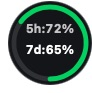
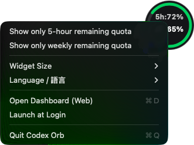
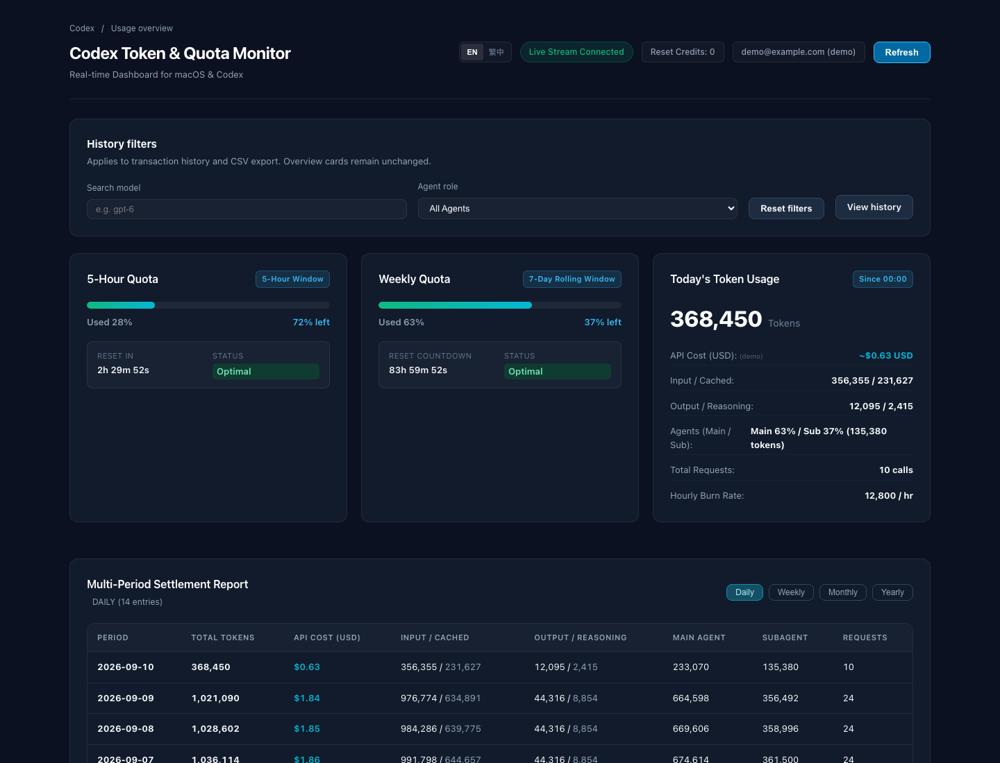
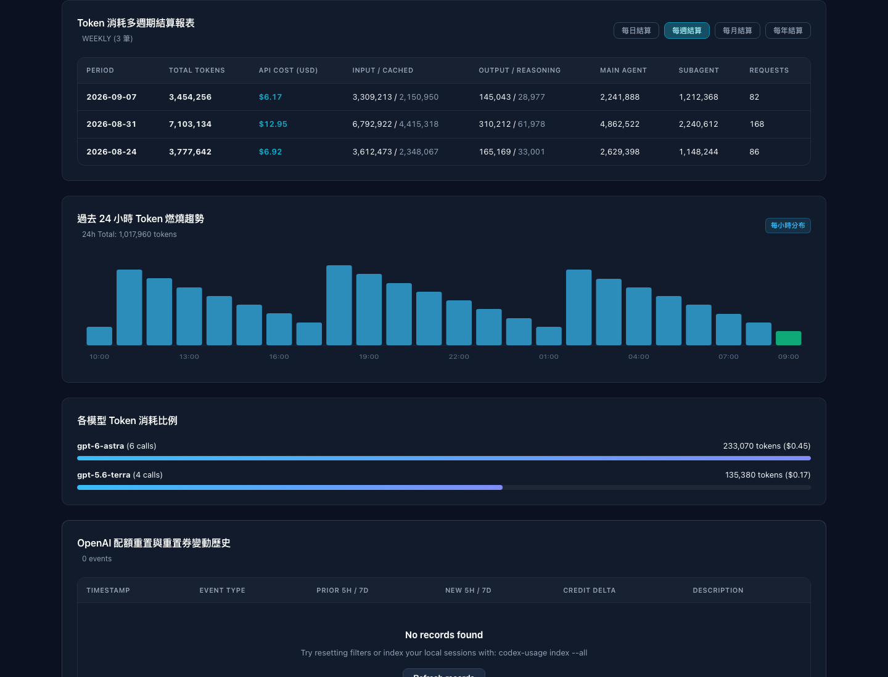
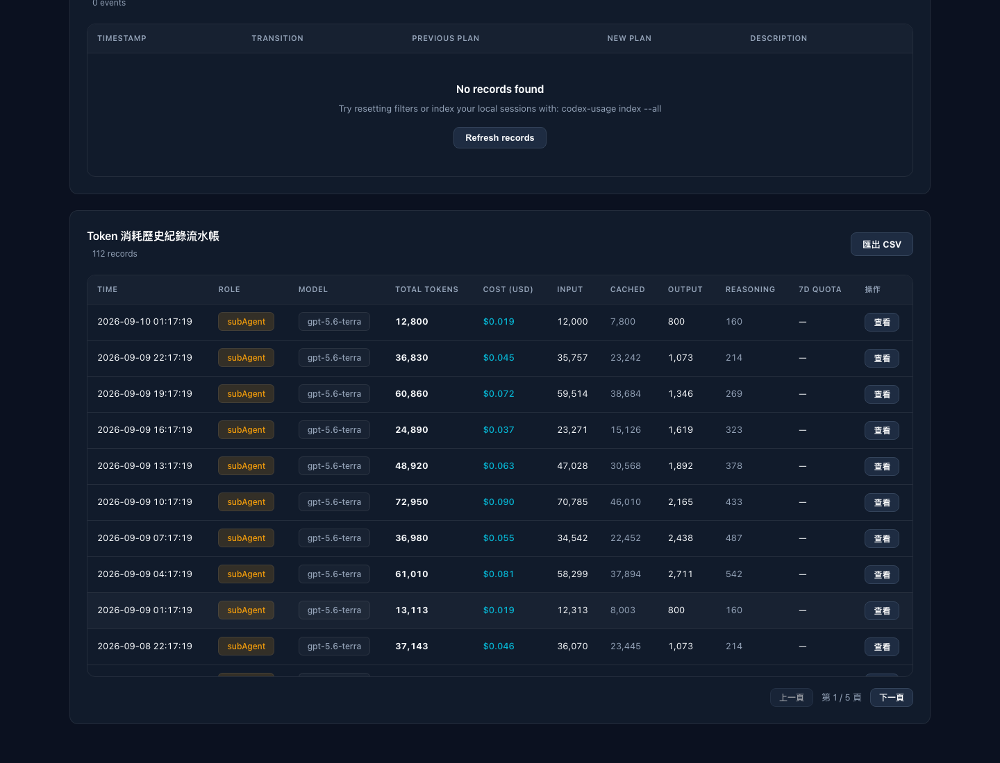
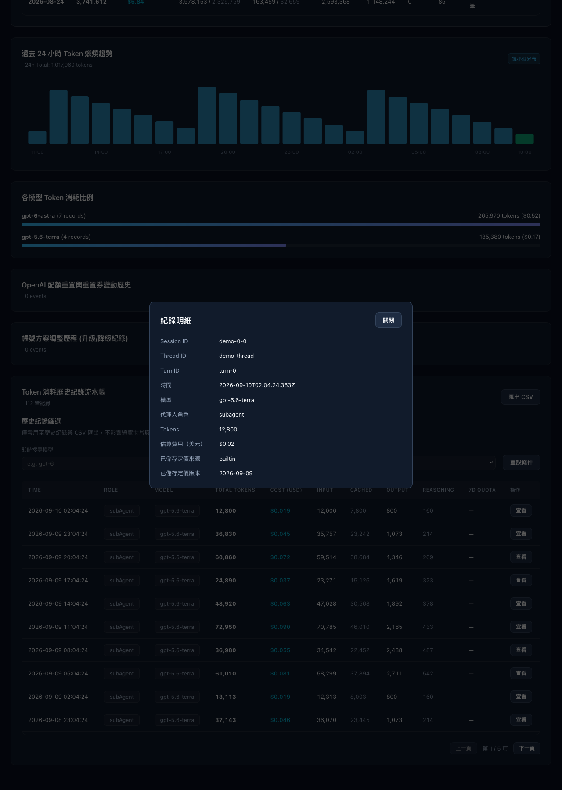
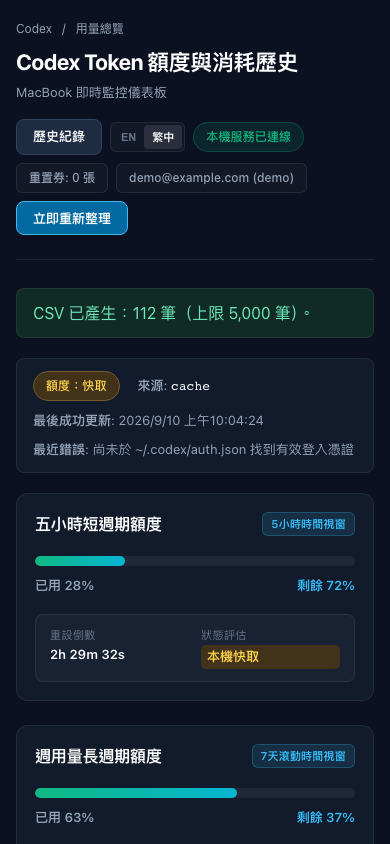

# Codex Token & Quota Monitor

[](../LICENSE)

Track Codex quota, token history, and estimated costs locally. Includes a web dashboard, CLI, macOS HUD/menu bar, and MCP server.

[正體中文](../README.md) · [English](README.en.md) · [日本語](README.ja.md) · [简体中文](README.zh-CN.md)

## Screenshots

Shown with demo data. The UI supports English and Traditional Chinese.

### macOS HUD

Left-click to switch between quota and today’s estimated cost. Right-click to choose the quota display, size, and language.





### Web Dashboard



<details>
<summary>Weekly report, history, and narrow viewport</summary>






</details>

## Quick start

Requires Bun. Start with the demo:

```bash
git clone https://github.com/a861252012/codex-token-usage-history.git
cd codex-token-usage-history
bun install --frozen-lockfile
bun run demo
```

Open [http://127.0.0.1:10201](http://127.0.0.1:10201) · Ctrl+C

### Use your Codex history

```bash
./bin/codex-usage dashboard
```
The service imports full history automatically at startup, then updates incrementally. No manual indexing is needed.

Open [http://127.0.0.1:10200](http://127.0.0.1:10200)

Reads `~/.codex` by default; set `CODEX_HOME` for a different core data directory. Quota queries require local `auth.json`; history remains available without live quota.

## Commands

| Purpose | Command |
| --- | --- |
| Read-only environment diagnostics | `./bin/codex-usage doctor` (or `doctor --json`) |
| Quota and daily usage | `./bin/codex-usage status --json` |
| Live terminal view | `./bin/codex-usage live` |
| Recent records | `./bin/codex-usage history --limit 50` |
| Subagent history | `./bin/codex-usage history --role subagent --json` |
| Unknown-role history | `./bin/codex-usage history --role unknown --json` |
| CSV export | `./bin/codex-usage history --csv --limit 5000` |
| Settlement report | `./bin/codex-usage report --period weekly` |
| Observed resets / plan changes | `./bin/codex-usage resets` / `./bin/codex-usage plans` |
| Full scan with diagnostics | `./bin/codex-usage index --all --json` |
| Force reread of legacy files | `./bin/codex-usage index --all --force --json` |
| Inspect / refresh pricing | `./bin/codex-usage pricing` / `./bin/codex-usage pricing update` |
| Recalculate stored estimates | `./bin/codex-usage reprice` |
| Shell status / help | `./bin/codex-usage prompt` / `./bin/codex-usage --help` |

## macOS

Requires Xcode Command Line Tools. Drag the HUD to move it, left-click to switch metrics, and right-click for settings.
Enable “Launch at Login” in the right-click menu to start the HUD at your next login. Click again to disable it; re-enable it after moving the project.
Dashboard → HUD settings controls the refresh interval: default 5 seconds, integers from 1 to 300. Changes apply by the next HUD refresh.

```bash
bash scripts/build-hud.sh
bash scripts/build-menubar.sh
./bin/codex-usage hud
./bin/codex-menubar &
```

Optional: `bash scripts/install.sh` creates a global shortcut, attempts MCP configuration, and generates a LaunchAgent plist without loading it.

<details>
<summary>Node.js</summary>

Requires Node.js with `node:sqlite`. Tests and Bun bundling still require Bun.

```bash
node -e 'require("node:sqlite")'
npm install
npx tsc
node --no-warnings dist/cli/index.js dashboard
```

</details>

## MCP

Replace the path with your project directory:

```toml
[mcp_servers.codex_token_usage]
command = "/absolute/path/codex-token-usage-history/bin/codex-usage"
args = ["mcp"]
enabled = true
```

`get_codex_quota` · `get_codex_usage_history` · `get_codex_settlement_report` · `get_codex_reset_events` · `get_codex_plan_changes` · `get_codex_pricing_info`

## Usage notes

- Costs are API-equivalent estimates. Each record retains its pricing source and version.
- History filters apply only to the table and CSV; exports are limited to 5000 records.
- Roles without evidence remain `unknown`. Use `index --all --force --json` to reread sources; `reprice` recalculates stored costs.
- Quota displays its source, update time, and errors. Scan diagnostics cover only that process’s latest scan.
- The dashboard is local-only. Some native UI and installer paths remain fixed to `~/.codex`.

## Development

```bash
bun test
bun run typecheck
bun run build
```
